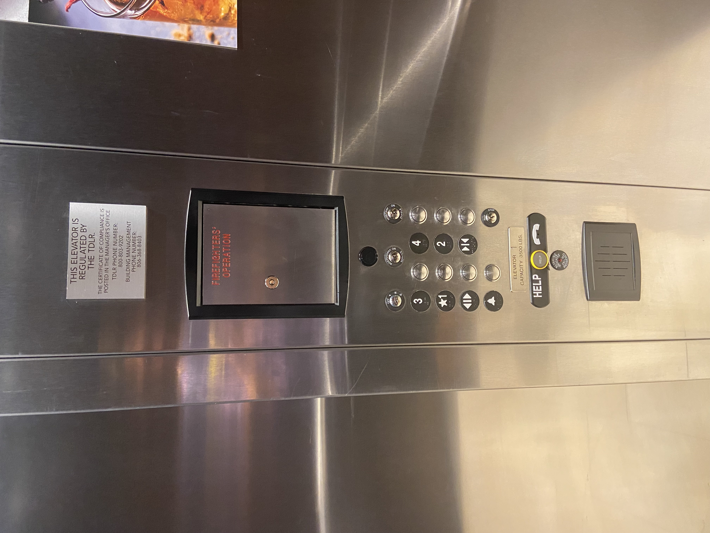
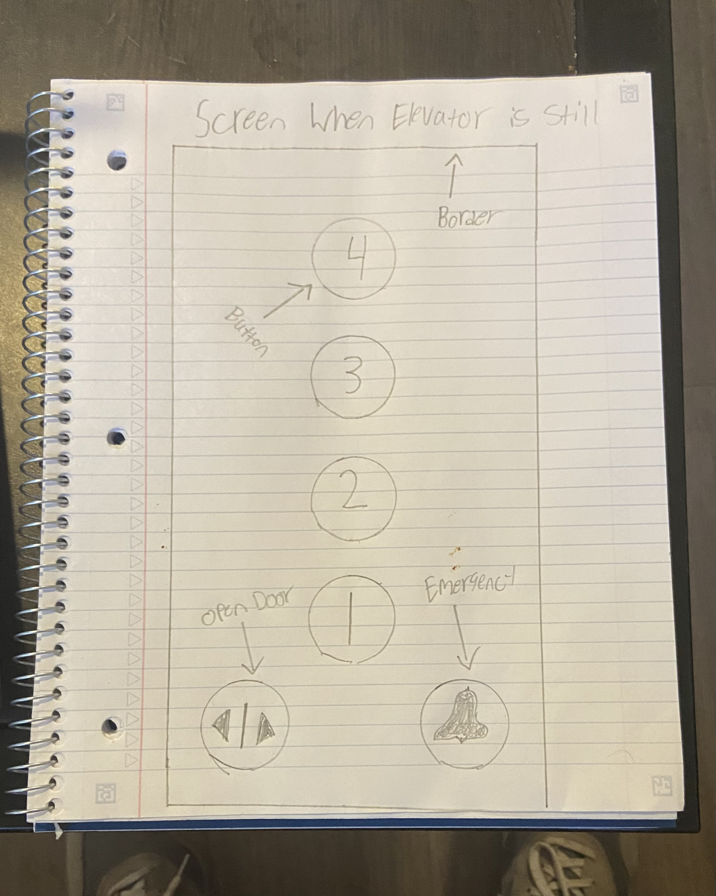
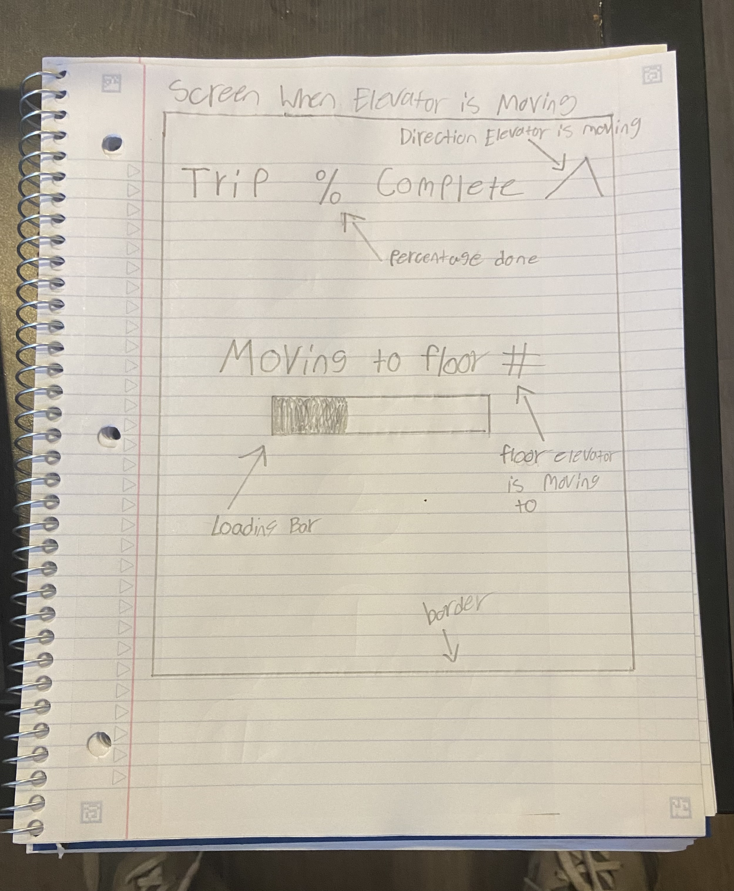

# Project1

Current Design Issues
1. The Layout of the floor buttons does not match between the system and the real world.
2. The buttons do provide a small amount of feedback when the button is pressed revealing a fine white light around the button.
   However it is very difficult to see and provides no other feedback that the button has been pressed. 
3. The Elevator does not inform the user to the direction the elevator is currently going or the floor it is approaching next. This provides no visibility of System Status for the User.
4. All of the buttons on this elevator are very compact and it makes it hard for users to see the buttons they want.
5. There is very little audio feedback on this elevator. The elevator only makes a dinging sound when it has reached a floor and offers no more information.
6. The places where staff can insert keys on this elevator look like buttons themselves and are way too close to the buttons which can cause confusion.There is also an extra black button that serves no purpose when selected.
7. Some button labels are centered while others are not.

Overall the user interface on this elevator isnt terrible. There are no incredibly big design flaws but there are many smaller design issues that can easily be improved and provide an overall better experience for the user.

Common Elevator Uses for the User
1. User going up to thier room.
2. User going down from thier room.
3. User selecting the appropriate floor.
4. User holding the elevator open.
5. User checking to see what floor they are on.
6. User checking elevator direction(either up or down)
7. User closing the elevator doors

Uncommon Elevator Uses for the User
1. User hitting the emergency button 
2. User selecting every floor.
3. User needs Audio Feedback 

The current elevator interface does not provide the best experience for those using the elevator for common activities.
When users enter the elevator and go to press a button the layout requires the users to think and pay attention to thier actions more than is neccesary. Finding the close and open door buttons is more difficult than neccesary and checking the direction and floor that you are going to is impossible. When the user has selected a floor button the feedback provided is too little. It is hard for users to tell the button has been selected at all and no audio feedback is given. Furthermore the open and close door buttons provide absolutely no feedback for the user when pressed. The elevator interface does provide appropriate feedback for emergency uses.

Common Mistakes with the Current Interface
1. Users will press the wrong floor by mistake wasting time.
2. Users will not realize they have selected a button due to lack of feedback and will press the buttons repeatedly.
3. Users will not realize they are not on the correct floor and will walk off prematurely.
4. Users may not realize the elevator is going the opposite direction than they intended.
5. Users may select the button that does nothing.

Improvements

1.First and foremost change the button layout to vertical. This will match the system to the real world and be much easier for users.
2. Change the small white light feedback to a bright red so users can really see when a button is pressed.
3. Give the users a way to see what floor they are going to.
4. Give the users a way to see what direction the elevator is going.
5. Provide audio feedback for users.
6. Give users a way to see the current status of the elevator in real time.

Sketch of New Design

This design is much more ideal for users for many reasons. It has a very simple and sleek design easy for users to use and understand. Plenty of audio and visual feedback for users. The buttons light up bright red and call out the floor number that has been selected. The close door button has been removed entirely because this elevator automatically closes if the touchscreen has not been pressed in the last five seconds. The open door button will hold the door open another five seconds when pressed. When the elevator has begun moving the touchscreen will tell you exactly what floor you are moving to as well as the direction the elevator is traveling to avoid confusion. It will also tell you how close you are to the next floor with a simple loading bar and percentage number. This new design is sleek yet simple and will get rid of all the problems users may have faced in the original interface.

